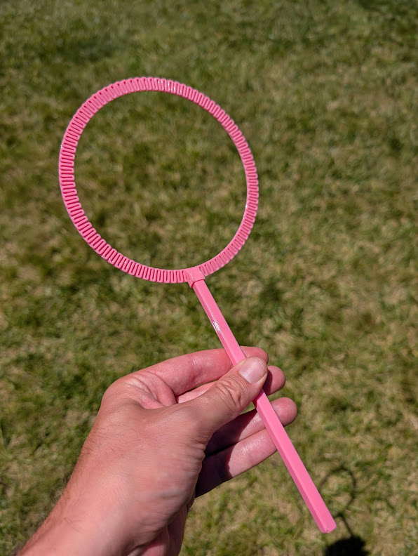
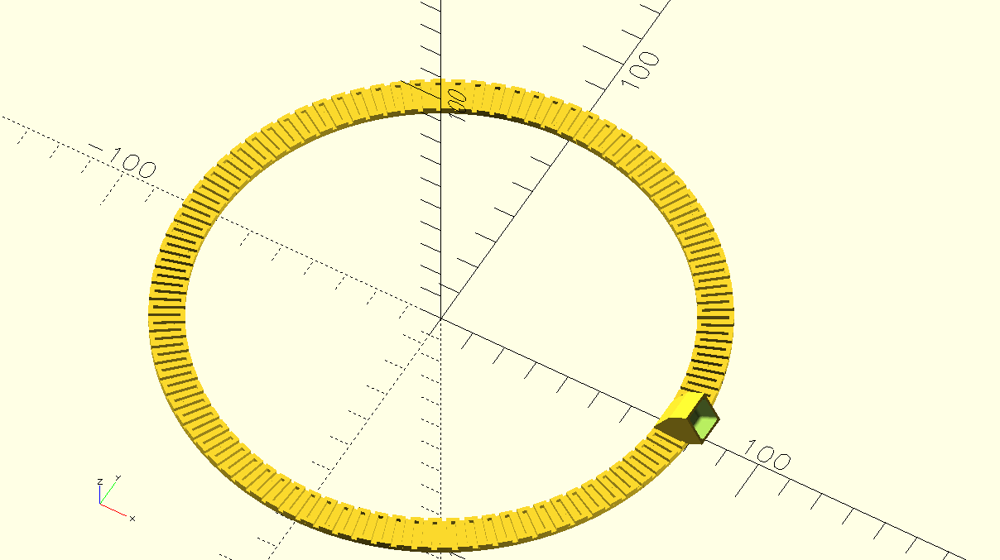
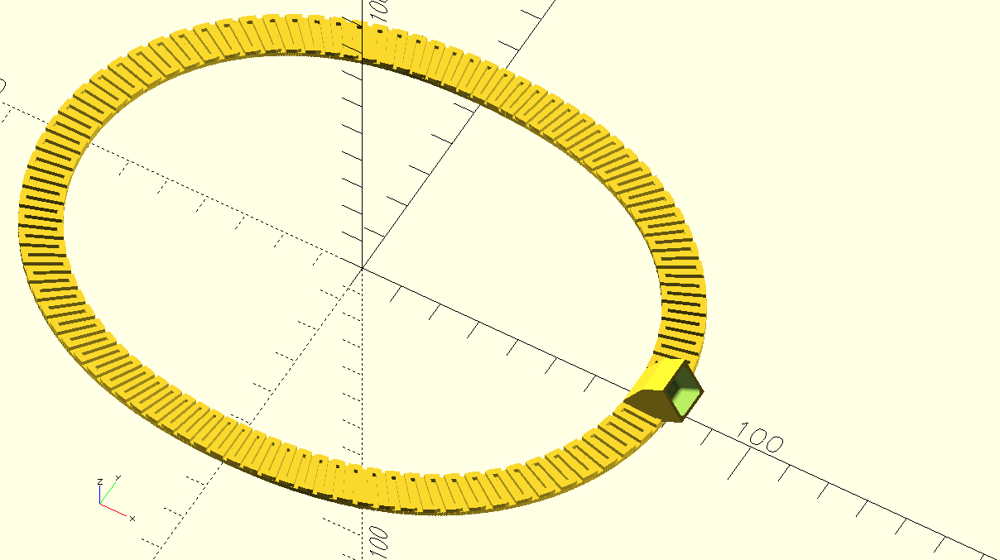
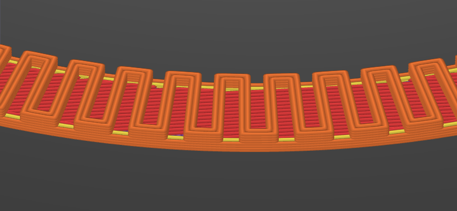
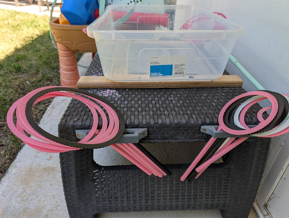

# Bubble Wand

A custom-designed, 3D-printable bubble wand and storage rack, built with [OpenSCAD](https://openscad.org/) and the [BOSL2](https://github.com/BelfrySCAD/BOSL2) library.

Designed for my daughters and their friends.

---

## Wand

OpenSCAD Source: [Bubble_Wand.scad](./Bubble_Wand.scad)

The wand consists of two printed parts:

| Part | Description |
|------|-------------|
| **Ring** | A thick, toothed bubble loop that holds the bubble film. The serrated edges help retain more bubble solution for bigger, stronger bubbles. |
| **Handle** | A long, slim rod that fits small hands comfortably. |



Both parts are printed separately and glued together with superglue (CA glue). The handle adapter on the ring creates a strong mechanical bond.

### Ring Shapes

The wand supports **two ring profiles**, controlled by commenting/uncommenting the `radius()` function in `Bubble_Wand.scad`:

| Shape | Code |
|-------|------|
| **Circular (default)** | `function radius(r,angle) = r;` |
| **Oval** | `function radius(r,angle) = ((0.5*sin(angle))^2+0.75)*r;` |

Simply uncomment your preferred line and comment the other, then re-render.

     

### Optimized for Clean FDM Printing

This model was designed with FDM printing in mind from the start. Every feature serves to minimize retractions, eliminate unnecessary travel moves, and produce a clean, reliable print.

- **Minimal retractions** — The zig-zag tooth pattern is laid down in a continuous, unbroken tool path. The nozzle never needs to lift or cross an open gap, so there's no oozing, stringing, or scarring on the finished part.
- **No travel moves** — Each layer of the ring consists of a single, uninterrupted extrusion. The print head moves from tooth to tooth without retracting or traveling, which saves time and reduces surface blemishes.
- **Optimized for 0.6mm nozzles** — The 1.2mm slot width is exactly two extrusion widths wide on a 0.6mm nozzle. This means the slicer can fill each tooth cleanly without gaps or thin-wall issues.
- **0.4mm nozzle compatibility** — For 0.4mm nozzles, simply increase the extrusion width to 0.6mm in your slicer settings, or decrease the `slot_width` parameter to 0.8mm.



The screenshot above shows the print path as planned by the slicer. Notice how the extruded lines flow continuously across the teeth — there are no retraction dots, no travel lines, and no visible starts or stops on the outer surface.

### Printing Instructions

**Step 1 — Render the ring with its handle adapter:**
```openscad
ring();
handle_adapter();
// handle(x=8);          // <-- keep commented
```

**Step 2 — Render the handle separately:**
```openscad
// ring();
// handle_adapter();
handle(x=8);
```

**Step 3 — Glue.** Apply superglue to the handle adapter (the small rectangular nub on the ring) and insert it into the matching hole on the handle. Hold for 30 seconds.

### Parameters

All adjustable values are at the top of `Bubble_Wand.scad`:

| Variable | Default | Description |
|----------|---------|-------------|
| `ring_radius` | `70` | Radius of the bubble ring |
| `ring_thickness` | `10` | Thickness (depth) of the ring's teeth |
| `slot_width` | `1.2` | Width of each tooth/gap |
| `slot_height` | `1.2` | Height of the tooth profile |

---

## Wand Rack / Mount

The [Wand_rack_mount.scad](./Wand_rack_mount.scad) file generates a clamp-on bracket that mounts to the edge of a surface (e.g., a bubble table, plastic stool, or bench). It can securely mount several wands.



---

## Bubble Solution

See the [Bubble Solution Recipe](./Bubble_Solution.md) for the homemade bubble mix that makes these wands really shine.

---

## License

This project is open source under the [MIT License](LICENSE). Print, modify, and share freely!
